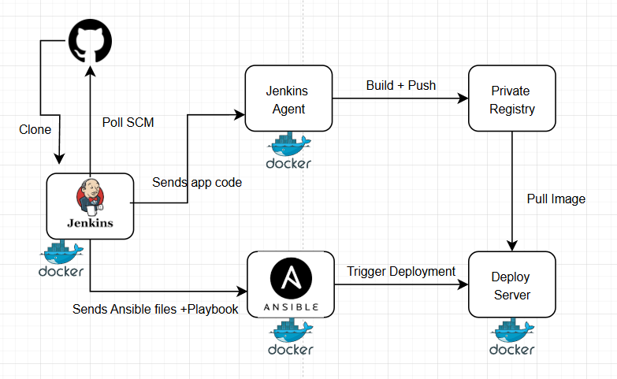

🚀 Node.js App Deployment with Ansible & Jenkins
This project is a basic Node.js full-stack application (React frontend + Express backend) deployed using Ansible automation and Jenkins CI/CD pipeline.

📂 Project Structure Overview
bash
Copy
Edit
.
├── BackEnd/       # Node.js backend (Express)
├── FrontEnd/      # React frontend
├── ansible/       # Ansible automation scripts
├── Jenkinsfile    # Jenkins CI/CD pipeline
├── compose.yaml   # Docker Compose setup
✅ Step-by-Step Guide
🔧 Step 1: Backend & Frontend Setup
Backend: Simple Express server with routes and models.

Frontend: React app with build, src, and public.

Each has its own Dockerfile for containerization.

⚙️ Step 2: Configure Docker Compose
The compose.yaml file defines how both frontend and backend services run together.

Run locally with:

bash
Copy
Edit
docker-compose -f compose.yaml up --build
📦 Step 3: Ansible for Automated Deployment
Ansible handles all automation:

Inventory: Define your remote host in inventory.ini.

Roles:

defaults/: Default vars.

tasks/: Setup, config, deploy, verify, and cleanup.

templates/: Dynamic .env file (compose.env.j2).

Playbook: Run deploy-playbook.yaml to execute the role.

To deploy:

bash
Copy
Edit
ansible-playbook -i inventory.ini deploy-playbook.yaml
🔄 Step 4: Jenkins CI/CD Pipeline
Jenkins monitors the repository.

On code changes or manual trigger:

Builds frontend & backend

Deploys using Ansible

The pipeline logic is inside the Jenkinsfile.

📁 Assets
You can add screenshots or architecture diagrams here:

markdown
Copy
Edit

🧰 Requirements
Docker

Ansible

Jenkins

Node.js (for local testing)

💬 Notes
Environment-specific variables are managed via .env and config.env.

Each service is isolated and containerized using Docker.

The roles/app_deployer in Ansible handles a full deployment lifecycle.